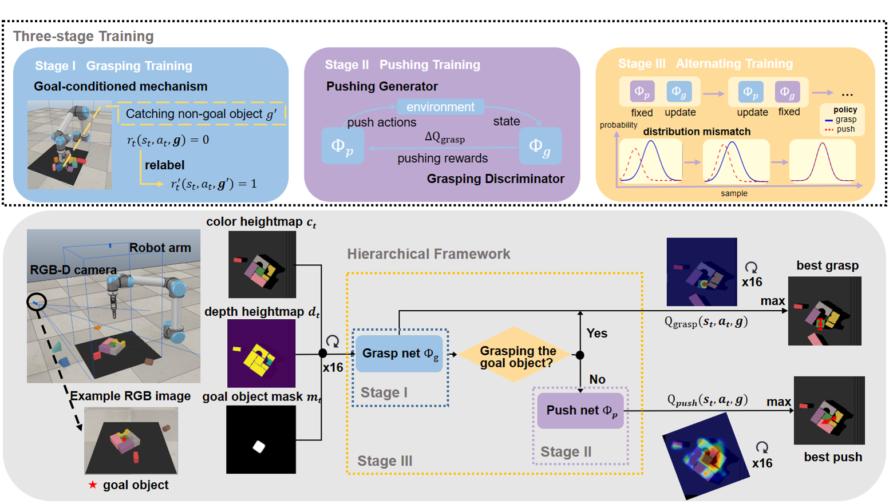
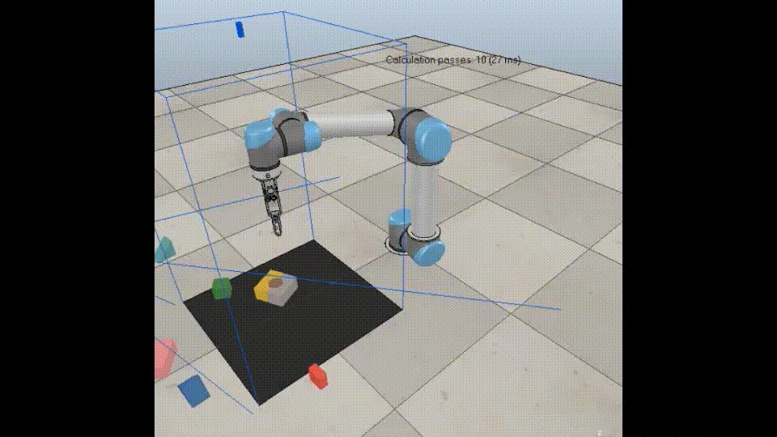
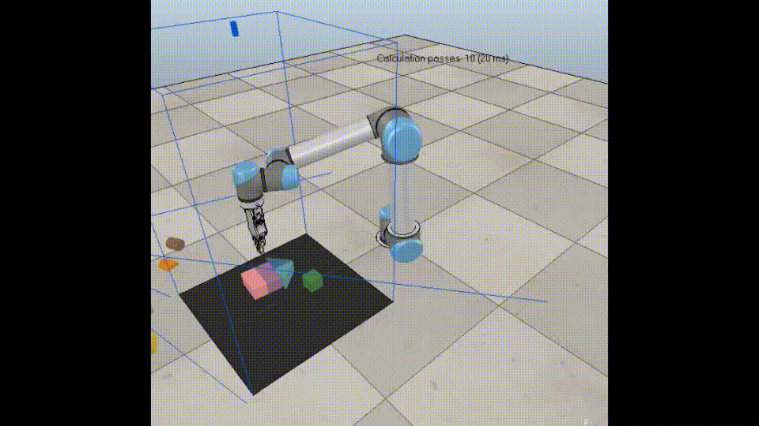
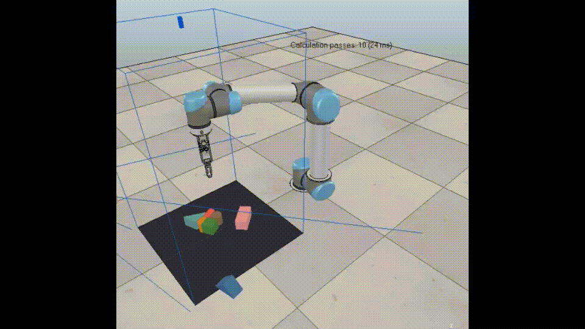
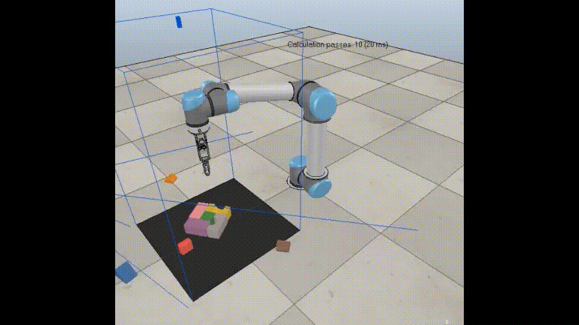

# Efficient learning of goal-oriented push-grasping synergy in clutter
This is the official repository for the paper: Efficient learning of goal-oriented push-grasping synergy in clutter.

The paper is available at https://arxiv.org/abs/2103.05405


We focus on the task of goal-oriented grasping, in which a robot is supposed to grasp a pre-assigned goal object in clutter and needs some pre-grasp actions such as pushes to enable stable grasps. However, sample inefficiency remains a main challenge. In this paper, a goal-conditioned hierarchical reinforcement learning formulation with high sample efficiency is proposed to learn a push-grasping policy for grasping a specific object in clutter. In our work, sample efficiency is improved by two means. First, we use a goal-conditioned mechanism by goal relabeling to enrich the replay buffer. Second, the pushing and grasping policies are respectively regarded as a generator and a discriminator and the pushing policy is trained with supervision of the grasping discriminator, thus densifying pushing rewards. To deal with the problem of distribution mismatch caused by different training settings of two policies, an alternating training stage is added to learn pushing and grasping in turn. A series of experiments carried out in simulation and real world indicate that our method can quickly learn effective pushing and grasping policies and outperforms existing methods in task completion rate and goal grasp success rate by less times of motion. Furthermore, we validate that our system can also adapt to goal-agnostic conditions with better performance. Note that our system can be transferred to the real world without any fine-tuning.



#### Contact

Any questions, please let me know: kcxu@zju.edu.cn

## Installation

- Ubuntu 18.04
- Python 3
  - torch>=0.4.0, torchvision
  - numpy, scipy, opencv-python, matplotlib, skimage, tensorboardX
- V-REP / CoppeliaSim (simulation environment)
- Cuda 10.1
- GTX 2080 Ti, 12GB memory is tested

## Train

To train a policy with this code from scratch in simulation, the following three stages are needed.

#### 1. Train a goal-conditioned grasp net

In the first stage, we train a goal-conditioned grasp net. To improve the sample efficiency, a goal-conditioned learning mechanism is introduced. 

```python
python main.py --stage grasp_only --num_obj 5 --grasp_goal_conditioned --goal_conditioned --goal_obj_idx k --experience_replay --explore_rate_decay --save_visualizations
```

k is the index of the object. During our training, we set `k=4`.

We use  ε-greedy strategy for exploration. And we find that exploring with a pre-trained goal-agnostic grasp model can effectively speed up the training process. In this case, we need to load our pre-trained grasp net without any goal conditions.

```python
python main.py --stage grasp_only --num_obj 5 --grasp_goal_conditioned --goal_conditioned --goal_obj_idx k --experience_replay --explore_rate_decay --save_visualizations --grasp_explore --load_explore_snapshot --explore_snapshot_file 'DIRECTORY OF YOUR PRE-TRAINDE GOAL-AGNOSTIC GRASP NET'
```

#### 2. Train a goal-conditioned push net

In this stage, we focus on training a push net, and parameters of the pre-trained grasp net are fixed.

```python
python main.py --stage push_only --grasp_reward_threshold Qg --grasp_goal_conditioned --goal_conditioned --goal_obj_idx k --experience_replay --explore_rate_decay --save_visualizations  --load_snapshot --snapshot_file 'DIRECTORY OF YOUR PRE-TRAINDE GOAL-CONDITIONED GRASP NET' 
```

**How to confirm `Qg`?**  `Qg` is a threshold of grasp q value which infers a high graspable probability. This value is confirmed based on the former training stage. During our training in the former stage, grasping success rate of goal object would become stable above 80% while grasp Q-value stays stably above `Qg=1.8`. Thus it is reasonable to regard  `Qg=1.8` as a threshold to evaluate whether is suitable for goal grasping.

#### 3. Alternating training

In the previous stage, we just consider the grasp net as an expert and fix its network parameters when training the push net. However, the former grasping net is trained in a relatively scattered environment where there is little occlusion around the goal object with only grasp actions. In this stage, we aim to further improve the performance of our pushing and grasping policies in cluttered environments by alternately training to relieve the the problem of distribution mismatch.

Train the grasp net:

```python
python main.py --stage push_only --alternating_training --grasp_goal_conditioned --goal_conditioned --goal_obj_idx k --experience_replay --explore_rate_decay --save_visualizations  --load_snapshot --snapshot_file 'DIRECTORY OF YOUR PRE-TRAINDE GOAL-CONDITIONED PUSH-GRASP NET' 
```

Train the push net: 

```python
python main.py --stage push_only --grasp_reward_threshold Qg --grasp_goal_conditioned --goal_conditioned --goal_obj_idx k --experience_replay --explore_rate_decay --save_visualizations  --load_snapshot --snapshot_file 'DIRECTORY OF YOUR PRE-TRAINDE GOAL-CONDITIONED PUSH-GRASP NET' 
```

By the way, we provide other training options e.g.

```python
--cooperative_training # training grasp and push nets together
--continu_logging --logging_directory 'YOUR SESSION DIRECTORY'
```

## Test

We test the model with 10 challenging test cases. Goal object setting of each case is:

```
# case index-goal object index #
0-4, 1-7, 2-8, 3-7, 4-7, 5-3, 6-1, 7-7, 8-5, 9-9
```

To test the pre-trained model, simply change the location of `--snapshot_file`:

```python
python main.py --stage push_grasp --num_obj 10 --experience_replay --explore_rate_decay --is_testing --test_preset_cases --test_preset_file 'simulation/test-cases/test-10-obj-06.txt' --load_snapshot --snapshot_file 'YOUR SNAPSHOT FILE' --save_visualizations --grasp_goal_conditioned --goal_conditioned --goal_obj_idx 1 
```

## Evaluation

We use three metrics to evaluate the performance: completion, grasp success rate, motion number. Data from each test case will be saved into a session directory in the `logs` folder. To report the average testing performance over a session, run the following:

```python
python evaluate.py --session_directory 'YOUR SESSION DIRECTORY' --num_obj_complete 1
```

## Demos (4x)



 

## Acknowledgment

We use the code in https://github.com/andyzeng/visual-pushing-grasping.

